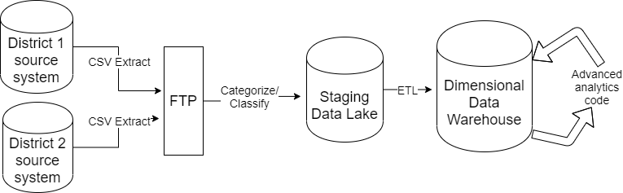
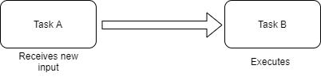
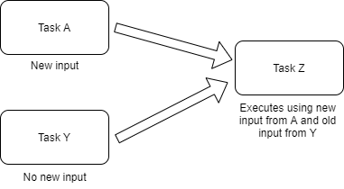
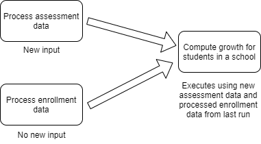
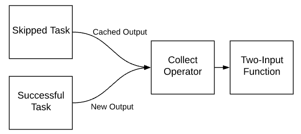

```{r setup, include=FALSE}
knitr::opts_chunk$set(echo = FALSE)
```

```{r xaringan-themer, include = FALSE}
library(xaringanthemer)
mono_dark(base_color = "#cbf7ed")
```

class: inverse, center, middle

.center[


# Data Engineering at Education Analytics 

### Jordan Mader, Director of Analytics Engineering

### Erik Joranlien, Manager of Data Engineering

#### jordanmader13.github.io/big_data_meetup

#### Feb 25, 2020

]

---

## Outline of this talk

-	Overview of a project we are working on

--

-	Focus on a few unique technical challenges we encountered

--

-	Upcoming work and new problems to solve

--

-	Demo a few ways the data is used in the field by educators, administrators, parents/families, students

--

-	Note: A big team works on this at EA, you will hear from only some of us, but not most who have contributed important things to this work

---

## Who we are
-	Education Analytics, Inc. is a non-profit organization that partners with school districts and state departments of education to use data and analytics to make better decisions

--

-	Our team's background is in implementing complex econometric methods

--

-	Economists & statisticians, research analysts, data engineers, software developers, data strategists 

--

-	Hiring (research analysts and data engineers!)

--

-	Headquartered in Madison, WI

```{r out.width='100%', fig.height=6, eval=require('leaflet')}
library(leaflet)
leaflet(height = 300) %>% 
  addTiles() %>%
  setView(-89.381447, 43.075023, zoom = 16) %>% 
  addMarkers(lng=-89.381447, lat=-43.075023, popup="EA Headquarters")

```

---

.center[


CORE Districts is a non-profit network of California school districts working to innovate,
implement, and scale new strategies and tools that eliminate equity and achievement gaps and lead to successful outcomes
for all students

The CORE Data Collaborative encompasses 3 million students in 100+ districts including Los Angeles, San Francisco, Oakland, Sacramento, Fresno, and Long Beach. 

]
.center[

]
---

## Project outline

-	CORE Districts wanted to create a data system to monitor performance metrics and conduct research oriented toward improvement 

--

- Goal: More innovation and faster turn-around than the state provides; foster collaboration between districts. 

    - Metrics about a school year often come out in January of the following year 

--

- Initially, we provided one part: an annual analysis of student growth

--

-	First try: university research center-- files uploaded, grad students write code to compute metrics, CSV of results shared

--

-	Second try: hired a for-profit data warehousing & dashboarding vendor

--

-	Third try: we decided to build something ourselves 

--

-	One note: our data isn’t really that “big” by most standards!

---

## System requirements

-	150+ school districts (with ~40 data centers) upload source system extracts. 25+ file types. 

    - Annual data covering five years of history

--
    
- Get the metric business rules exactly right 

--

- *Never show anything clearly wrong* (like a 0% graduation rate) even if the data meets the spec

--

-	Users need to see updated metrics in a dashboard within 48 hours or know what they need to do to fix it 
    - Includes metrics from simple averages to grad rates to estimates of school impact on student learning

--

-	Data warehouse for analytics and continued ad-hoc research 

  - One source of truth

---

## Overall design (platform agnostic)

.center[


]

---

## Key system/project goals

-	Transparency & clarity of business rule calculations

--

-	Extensibility as data collection, metric needs, user base grows

--

-	Fail loudly

--

-	Only execute what needs to be executed

--

-	Be able to reproduce everything that happened 

--

-	Avoid closed or proprietary systems

---

## Design Restrictions

- PII needed to stay on prem for contractual reasons

--

- Business logic in R, where the team was most comfortable

--

- Resilient to bad data
  - Incorrect labeling, ragged CSVs, uniqueness violations, etc
  
--

- Complex aggregates with many dependencies

---

## Initial build tech stack (and reasons)

.center[


Airflow for workflow management

]


---

## Initial build tech stack (and reasons)

.center[


PostgreSQL for data storage, management, simple aggregates

]


---

## Initial build tech stack (and reasons)

.center[


R for more complex analytics code & statistics, and some data manipulation

]

---

## Initial build tech stack (and reasons)

.center[


Currently runs on linux VMs on our own servers

]

---

## Technical problem focus: output caching

-	Airflow is great at orchestrating ordered, dependent operations

--

-	Plan: 
  - Poll FTP for new files
  - Cascade changes through the DAGs
  - Use cached versions of intermediate objects

--

-	But, no built-in way to handle file caching

---

## Technical problem focus: output caching 

.center[


Typical model

]

---

## Technical problem focus: output caching 

.center[


Common situation

]

---

## Technical problem focus: output caching 

.center[


Example

]

---

## Technical problem focus: output caching

-	Airflow runs R functions via Bash, collects and stores final line of output in XCom

--

-	We designed all our R functions to return their output path to STDOUT

--

-	New Collect operator:
  - Poll the XCom table for the output path of the _most recent success_ of each upstream dependency. (Output caching)
  
--

  - Implements a new trigger rule (at least one upstream success, no failures)

--

.center[

]

---

<a href = "http://core-comp-test.edanalytics.net:8080/admin/airflow/graph?execution_date=2019-09-12T20%3A53%3A52&arrange=LR&root=&dag_id=load_dw_ggusd_1819&_csrf_token=ImQ0MDMwMmM1NGZiNjg4YWQxZDdkMzY3NjExYzg4ZmJkMmFiZmU1MWEi.ETX4tQ.o2c1KuCBjhHDBFBM2816JeFbHAQ">
A DAG with this operator implemented</a>


---

<a href = "http://core-comp-test.edanalytics.net:8080/admin/airflow/log?dag_id=growth_sausd_1819&task_id=hs_fun_run_district_growth&execution_date=2019-12-17T19%3A39%3A05">
a successful R call returning XCOM </a>


---

<a href = "http://core-comp-test.edanalytics.net:8080/admin/airflow/log?task_id=format_dist_results&dag_id=growth_mcoe_1718&execution_date=2020-01-22T21:00:00">
and one with an error</a>


---

## Technical problem focus: growth model automation

-	New districts join collaborative and want school impact measures

--

- Model predicts student performance and measures relative school impacts

--

-	Solution: 
  - Collect enough data to fit a stable model
 - Freeze model calibration parameters, apply them to new incoming data

--

-	Thousands of model parameters modeled in new database schema 
    -	Re-standardizations
    -	Covariances and identification

---

## Technical problem focus: growth model automation

-	How to ensure quality in an automated causal model?

--

- Run a lot of tests, give detailed feedback

--


--


---

## Technical problem focus: tracking metadata

--

-	“Why doesn’t my district have a graduation rate in the dashboard?” 

--

-	Solutions: 

--

    - Inventory queries that clarify where data gets “stuck” and why
    
--
    
    - Shiny to provide stakeholders with visibility into metadata

---
  
## Using R Shiny for inventory


---

## Future direction

--

- Leverage an open-source Education data standard.

  - Real-time data, much more granular
  - Standard REST API instead of flat files
  - Scale-able to districts outside California
  
--

- Columnar data warehouse, ELT
  
  - Move calculation closer to the data
  - Empower districts to bring their own BI tools

--

Tool Choice:

Snowflake, DBT, ???

---

## Uses of the data in the field

- <a href="https://dashboard.coredistricts.org/public/core">CORE school improvement dashboard for administrators</a>

- <a href="https://laschoolinfo.coredistricts.org/">Los Angeles School Info + for public</a>

- <a href="https://github.com/jordanmader13/slides/blob/master/big_data_meetup/CollegeRoadmap_GenericMockup_GR11Lane5.pdf"> Example predictive analytics student reports for students & families</a>

- <a href="https://projects.invisionapp.com/share/RFTJEJEQ2PG#/screens/387970385_BY_SCHOOL_TAKE_NEW"> School impact measures for administrators</a>

- <a href="https://edpolicyinca.org/initiatives/core-pace-research-partnership"> Research papers for researchers & practitioners</a> 

- <a href="https://coredistricts.org/our-work/improvement-communities/break-through-success-community-2/"> Breakthrough Success Community for teachers / school staff</a>  

---

## Thank You! 

## Slides: jordanmader13.github.io/big_data_meetup

